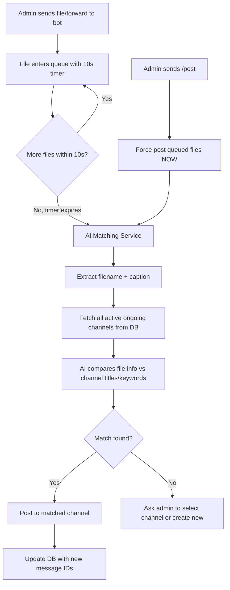
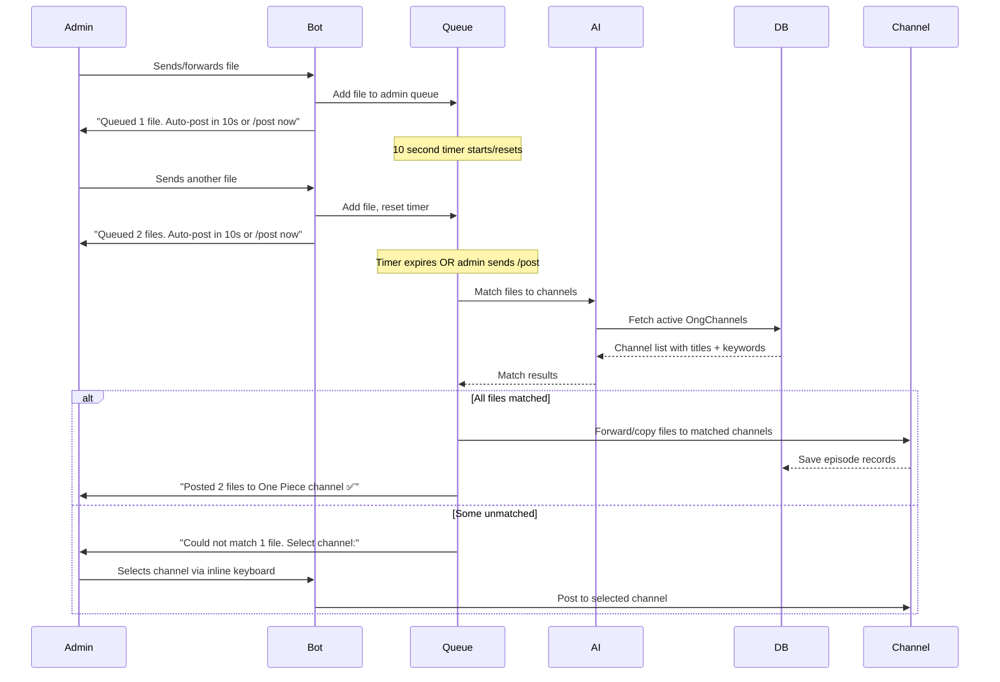

# Agentic Ongoing System Redesign

## Overview

Replace the current manual ongoing system with an **AI-powered agentic system** that automatically routes files to the correct Telegram channels based on filename/caption matching against registered ongoing series.

## Current System Problems
- Admin must manually specify which ongoing to add episodes to (`/addong {shareId}`)
- No auto-detection of which series a file belongs to
- No batching of multiple files
- No channel management (single hardcoded `DB_ONGOING_CHANNEL_ID`)

---

## New System Architecture

### Core Concept
Admin sends/forwards files to the bot → AI matches filename/caption to registered ongoing channels → Bot auto-posts to the correct channel after a 10-second batch window (or immediately on command).



### Commands

| Command | Description |
|---------|-------------|
| `/ong` | Enter ongoing management mode - view/add/remove/pause channels |
| `/auto` | Toggle auto-posting mode ON/OFF for the current session |
| `/post` | Force-post all queued files immediately |
| `/cancel` | Cancel current queue |

### Channel Management Flow

```mermaid
flowchart TD
    A[/ong command] --> B[Show Ongoing Dashboard]
    B --> C[Inline Keyboard Menu]
    C --> D[📋 List Channels]
    C --> E[➕ Add Channel]
    C --> F[🗑️ Remove Channel]
    C --> G[⏸️ Pause Channel]
    C --> H[▶️ Resume Channel]
    C --> I[📊 Stats]
    
    E --> E1[Admin sends channel ID or forwards from channel]
    E1 --> E2[Bot joins/verifies admin rights]
    E2 --> E3[Admin provides title + keywords for matching]
    E3 --> E4[Save to DB]
    
    D --> D1[Show all channels with status]
    D1 --> D2[active / paused / total episodes count]
```

---

## Data Models

### OngChannel (New - replaces single ongoing concept)

```typescript
interface OngChannel {
  channelId: number;          // Telegram channel ID where files get posted
  channelTitle: string;       // Display name e.g. "One Piece"
  keywords: string[];         // Matching keywords: ["one piece", "onepiece", "op"]
  status: "active" | "paused";
  totalEpisodes: number;      // Counter
  lastPostedAt: Date;
  createdBy: number;          // Admin user ID
  shareId: number;            // For user-facing share links
  aIOPosterID: string;        // Poster image
  createdAt: Date;
  updatedAt: Date;
}
```

### OngEpisode (New - tracks individual episodes)

```typescript
interface OngEpisode {
  channelId: number;          // Reference to OngChannel
  messageId: number;          // Telegram message ID in the channel
  filename: string;           // Original filename
  caption: string;            // Original caption
  postedAt: Date;
}
```

### FileQueue (In-memory, not persisted)

```typescript
interface QueuedFile {
  messageId: number;
  chatId: number;
  filename: string;
  caption: string;
  fileType: string;           // document, video, audio, photo
  receivedAt: Date;
}

interface FileQueue {
  adminId: number;
  files: QueuedFile[];
  timer: NodeJS.Timeout | null;
  autoMode: boolean;          // true = auto-post after 10s
}
```

---

## AI Integration

Reuse the same AI server pattern from email-marketing project (`http://api.yourdomain.com` with grok model).

### AI Provider for File Matching

```typescript
// New: src/lib/ai/fileMatchingProvider.ts
class FileMatchingAIProvider {
  // Uses same callAI pattern from email-marketing CustomAIProvider
  
  async matchFileToChannel(
    filename: string,
    caption: string,
    channels: OngChannel[]
  ): Promise<{ channelId: number; confidence: number } | null> {
    // Prompt: Given filename + caption, match to one of the channels
    // Returns best match with confidence score
    // If confidence < 70%, return null (ask admin)
  }
}
```

### AI Prompt Strategy

```
System: You are a file routing assistant. Match media files to their correct series/channel.

User: 
Filename: "[SubGroup] One Piece - 1120 [1080p].mkv"
Caption: "One Piece Episode 1120"

Available channels:
1. "One Piece" (keywords: one piece, onepiece, op)
2. "Naruto Shippuden" (keywords: naruto, shippuden)
3. "Dragon Ball Super" (keywords: dragon ball, dbs)

Which channel does this file belong to? Respond in JSON:
{ "channelIndex": 1, "confidence": 95, "reason": "filename contains 'One Piece'" }
```

---

## File Flow Detail



---

## Implementation Plan

### Phase 1: Core Infrastructure
1. Create AI provider module (`src/lib/ai/`) - port pattern from email-marketing
2. Create new MongoDB models: `OngChannel`, `OngEpisode`
3. Create in-memory `FileQueueManager` service
4. Add new env vars: `AI_SERVER_URL`, `AI_MODEL`, `AI_API_KEY`

### Phase 2: Channel Management (`/ong` command)
5. Create `/ong` command handler with inline keyboard dashboard
6. Implement "Add Channel" flow (wizard scene)
7. Implement "List Channels" with status display
8. Implement "Remove Channel" with confirmation
9. Implement "Pause/Resume Channel" toggle
10. Implement channel stats view

### Phase 3: Auto-Posting System
11. Create file reception middleware (detects files from admins)
12. Implement 10-second batching queue with timer management
13. Implement AI file-to-channel matching service
14. Implement auto-post logic (forward files to matched channel)
15. Implement `/post` command for immediate posting
16. Implement `/auto` command to toggle auto mode
17. Handle unmatched files (ask admin to select channel)

### Phase 4: Database Operations
18. Implement `createOngChannel()` in MongoDB service
19. Implement `getActiveOngChannels()` for AI matching
20. Implement `updateOngChannel()` for pause/resume/edit
21. Implement `deleteOngChannel()`
22. Implement `saveOngEpisode()` for tracking posted episodes
23. Implement `getOngChannelStats()`

### Phase 5: Integration & Cleanup
24. Register new commands in `main.ts`
25. Register new scenes in `scenes/index.ts`
26. Update `sample.env` with new AI config vars
27. Keep backward compatibility with existing `/createong` and `/addong` (deprecate gracefully)
28. Add error handling and logging throughout
29. Test the complete flow

---

## Environment Variables (New)

```env
# AI Configuration (same server as email-marketing)
AI_SERVER_URL=http://api.yourdomain.com
AI_MODEL=grok-code
AI_API_KEY=your_ai_api_key

# Auto-post settings
AUTO_POST_DELAY_MS=10000
AI_MATCH_CONFIDENCE_THRESHOLD=70
```

---

## File Structure (New/Modified)

```
src/
├── lib/
│   └── ai/
│       ├── index.ts                    # AI provider init (from email-marketing pattern)
│       ├── types.ts                    # AI types
│       ├── provider-interface.ts       # ILLMProvider interface
│       ├── custom-ai-provider.ts       # Grok AI provider
│       └── file-matching.service.ts    # File-to-channel matching logic
├── databases/
│   ├── interfaces/
│   │   ├── ongChannel.ts              # NEW: OngChannel interface
│   │   └── ongEpisode.ts             # NEW: OngEpisode interface
│   ├── models/
│   │   ├── ongChannelModel.ts         # NEW: Mongoose model
│   │   └── ongEpisodeModel.ts         # NEW: Mongoose model
│   └── mongoDB.ts                     # MODIFIED: add new CRUD methods
├── services/
│   ├── fileQueue.ts                   # NEW: In-memory file queue manager
│   └── database.ts                    # MODIFIED: add new methods
├── handlers/
│   └── commands/
│       ├── ong.ts                     # NEW: /ong dashboard command
│       ├── auto.ts                    # NEW: /auto toggle command
│       ├── post.ts                    # MODIFIED: /post force-post command
│       └── index.ts                   # MODIFIED: register new commands
├── scenes/
│   ├── ongDashboard/                  # NEW: channel management scene
│   │   ├── index.ts
│   │   ├── addChannel.ts
│   │   ├── listChannels.ts
│   │   ├── removeChannel.ts
│   │   └── sessionData.ts
│   └── index.ts                       # MODIFIED: register new scenes
├── middleware/
│   └── fileReceiver.ts                # NEW: intercepts files from admins
└── extra/
    └── configVar.ts                   # MODIFIED: add AI config vars
```

---

## Key Design Decisions

1. **AI-first matching**: Every file goes through AI matching. No manual shareId needed.
2. **10-second batch window**: Prevents spam-posting when admin sends multiple episodes. Resets on each new file.
3. **Confidence threshold**: If AI confidence < 70%, ask admin instead of guessing wrong.
4. **Channel-centric**: Each ongoing series = one Telegram channel. Bot posts directly to channels.
5. **In-memory queue**: No need to persist the queue - it's short-lived (10 seconds max).
6. **Backward compatible**: Old `/createong` and `/addong` still work but are deprecated.
7. **Same AI server**: Reuse the Grok AI server at `http://api.yourdomain.com` already used in email-marketing.
